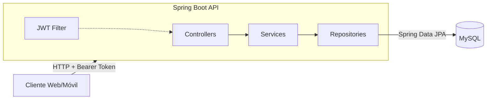

# Bazar Manager

## Descripción
Este proyecto es una API diseñada para manejar las operaciones de un bazar que ha incrementado significativamente sus ventas. Dado que el manejo manual del stock y registro de ventas se ha vuelto casi imposible, se requiere una solución automatizada. La API permitirá realizar todas las operaciones a través de una aplicación web y una aplicación móvil que utilizarán el mismo backend.

## Arquitectura



Capas clásicas (controllers → services → repositories) con un filtro JWT que valida el token en cada request antes de llegar al controller. Persistencia con Spring Data JPA contra MySQL. Schema versionado con Flyway en `dev`/`prod`; en `test` lo genera Hibernate.

## Tecnologías Utilizadas
- **Java 17**: Lenguaje de programación.
- **Spring Boot v3.2**: Framework principal para el desarrollo de la API.
- **Spring Security**: Para la autenticación y autorización de los usuarios.
- **JWT 0.12**: Para la generación de tokens de autenticación.
- **Spring Data JPA**: Para la persistencia de datos.
- **Hibernate**: ORM para mapear objetos a la base de datos.
- **MySQL**: Sistema de gestión de base de datos.
- **Flyway**: Versionado y aplicación de migraciones de schema.
- **Spring Boot Validations**: Para validar los datos de entrada en la API.
- **Mockito y JUnit**: Utilizados para realizar pruebas unitarias y de integración.
- **Docker**: Para empaquetar la app y sus dependencias, asegurando que se pueda ejecutar de manera consistente en diferentes entornos.
- **Swagger / springdoc-openapi**: Para documentar y visualizar todos los endpoints de la API.
- **ModelMapper**: Utilidad para mapear objetos.
- **Lombok**: Biblioteca para reducir el código repetitivo de Java, como getters, setters, etc.

## Cómo iniciar
1. Cloná el repositorio.
2. Creá las bases de datos en MySQL (la app no las crea sola; sí crea tablas):
   ```sql
   CREATE DATABASE bazar;
   CREATE DATABASE bazar_test;
   ```
3. Configurá las variables de entorno (ver tabla abajo). Como mínimo: `DB_URL`, `DB_USERNAME`, `DB_PASSWORD`, `JWT_SECRET`.
4. Levantá la app:
   ```bash
   ./mvnw spring-boot:run
   ```

La aplicación queda disponible en `http://localhost:8080`.

## Variables de entorno

| Variable | Descripción | Profile | Ejemplo |
| --- | --- | --- | --- |
| `DB_URL` | JDBC URL de MySQL para `dev` y `prod`. | `dev`, `prod` | `jdbc:mysql://localhost:3306/bazar?useSSL=false&serverTimezone=UTC` |
| `DB_TEST_URL` | JDBC URL de MySQL para tests (DB separada). | `test` | `jdbc:mysql://localhost:3306/bazar_test?useSSL=false&serverTimezone=UTC&createDatabaseIfNotExists=true&allowPublicKeyRetrieval=true` |
| `DB_USERNAME` | Usuario de MySQL. | todos | `root` |
| `DB_PASSWORD` | Password de MySQL. | todos | (tu password) |
| `JWT_SECRET` | Secreto HMAC para firmar tokens JWT. **Mínimo 32 bytes (256 bits)** para HS256; la app falla al startup si es más corto. | todos | generar con `openssl rand -base64 48` |
| `SPRING_PROFILES_ACTIVE` | Profile activo. Si no se setea, queda `dev` (definido en `application.properties`). | opcional | `prod` |

## Profiles

El proyecto usa tres profiles de Spring:

- **`dev`** (default): para desarrollo local. Logging verbose, `ddl-auto=validate` (Hibernate valida el schema contra las entidades, no lo modifica), Flyway habilitado con `baseline-on-migrate=true`. Se activa solo si no hay otro profile seteado.
- **`prod`**: para producción. Logging quieto, `ddl-auto=validate`, Flyway con `baseline-on-migrate=false` (exige migraciones explícitas desde V1). Se activa con `SPRING_PROFILES_ACTIVE=prod`.
- **`test`**: se activa automáticamente con `@ActiveProfiles("test")` en los tests. `ddl-auto=create-drop`, Flyway deshabilitado — Hibernate genera el schema al levantar el contexto de test.

## Migraciones (Flyway)

Las migraciones están en `src/main/resources/db/migration/` y se aplican automáticamente al arrancar en `dev` y `prod`. Para agregar una nueva:

1. Crear un archivo `V<N>__descripcion.sql` incrementando el número (ej. `V2__add_email_unique_constraint.sql`).
2. Escribir DDL/DML puro.
3. Al arrancar, Flyway detecta la nueva versión y la aplica; Hibernate valida que el schema resultante coincida con las entidades.

Si al arrancar `validate` reporta `SchemaManagementException: Schema-validation: missing column [...]`, significa que una entidad tiene un campo que no está en el schema — hay que agregar la migración correspondiente.

## Testing

Correr la suite completa:
```bash
./mvnw test
```

Los tests de integración (`@SpringBootTest`, `@DataJpaTest`) usan el profile `test` y necesitan las variables `DB_TEST_URL`, `DB_USERNAME`, `DB_PASSWORD` y `JWT_SECRET` definidas en el entorno. La DB de tests es **separada** (`bazar_test`); no se mezcla con `bazar`.

**Aislamiento entre tests:** cada `@SpringBootTest` que escribe en la DB está anotado con `@Transactional` para que cada método haga rollback al finalizar. Los `@DataJpaTest` ya son transaccionales por defecto. Esto evita contaminación entre clases. Como MySQL no rolea `AUTO_INCREMENT`, los asserts no dependen de IDs literales — usan el id devuelto por el servicio.

## Endpoints

Documentación interactiva con Swagger UI:
[http://localhost:8080/swagger-ui/index.html](http://localhost:8080/swagger-ui/index.html)

### Ejemplos rápidos con curl

```bash
# Registrarse (sin auth)
curl -X POST http://localhost:8080/auth/register \
  -H "Content-Type: application/json" \
  -d '{"firstname":"Juan","lastname":"Perez","email":"juan@example.com","password":"secret12"}'

# Login → devuelve { "token": "<JWT>" }
curl -X POST http://localhost:8080/auth/login \
  -H "Content-Type: application/json" \
  -d '{"email":"juan@example.com","password":"secret12"}'

# Listar productos (requiere token)
curl http://localhost:8080/productos \
  -H "Authorization: Bearer <TOKEN>"

# Crear cliente (requiere rol ADMIN)
curl -X POST http://localhost:8080/clientes/add \
  -H "Authorization: Bearer <TOKEN>" \
  -H "Content-Type: application/json" \
  -d '{"nombre":"Marcelo","apellido":"Troncho","dni":"36158188"}'
```

## Restricciones de acceso
- **Sin autenticación**: puede registrarse y loguearse.
- **Con autenticación y rol USER**: sólo puede ver Clientes y Productos.
- **Con autenticación y rol ADMIN**:
  * Ver, agregar, editar y eliminar Clientes, Productos y Ventas.
  * Consultar productos con falta de stock.
  * Consultar productos de una venta determinada.
  * Consultar monto total y cantidad de ventas de un día determinado.
  * Consultar la mayor venta realizada.

## Decisiones arquitectónicas

- **JWT stateless en lugar de sesiones server-side.** No hay storage compartido de sesiones; cada request lleva su propio token firmado. Trade-off conocido: la revocación requiere lista negra o expiración corta; para este proyecto la simplicidad operacional pesa más.
- **Flyway para versionado del schema.** El schema vive en `src/main/resources/db/migration/` como SQL versionado, no se infiere de las entidades en runtime. Esto hace que los deploys a `prod` sean reproducibles y auditables.
- **Tres profiles separados (`dev`/`prod`/`test`).** Cada uno tiene su `ddl-auto` y configuración de Flyway propios. Evita que un cambio en una entidad rompa una DB de prod sin pasar por una migración explícita.
- **DTO-first en controllers.** Las entidades JPA nunca se serializan directamente. Esto desacopla el contrato HTTP del modelo de persistencia, evita exponer relaciones lazy, y permite validar input con Bean Validation sin contaminar el modelo.
- **Dominio en español, infraestructura en inglés.** `Cliente`/`Producto`/`Venta` son del dominio del negocio que se piensa en castellano. `Controller`/`Service`/`Repository`/`Filter` son piezas técnicas convencionales del stack — quedan en inglés. Es una mezcla deliberada, no un descuido.

## Licencia
Este proyecto está disponible bajo la licencia MIT. Puedes utilizar y modificar el código según las condiciones de la licencia.
